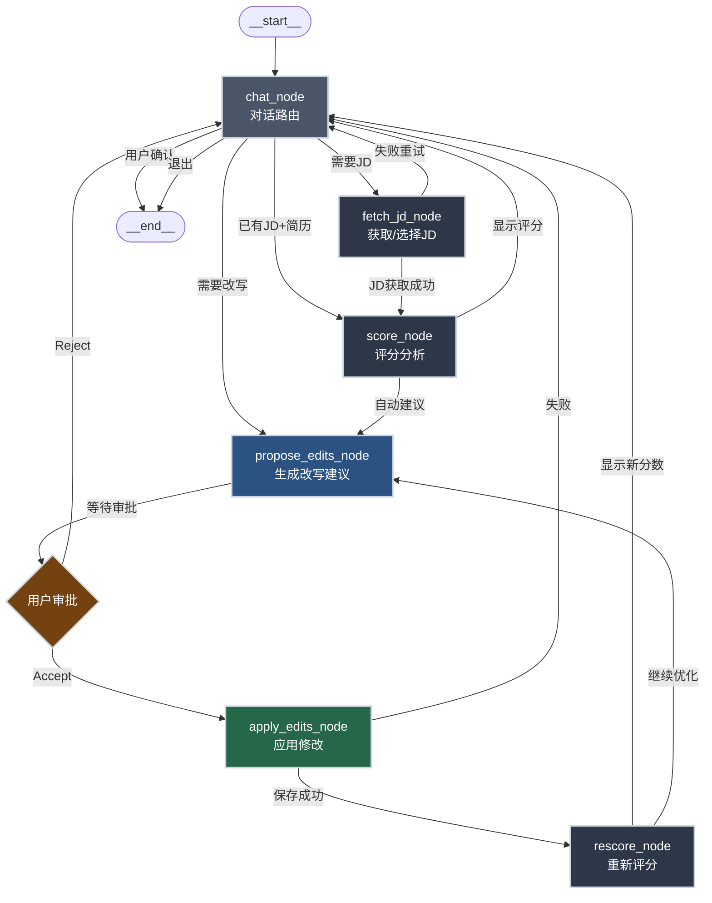
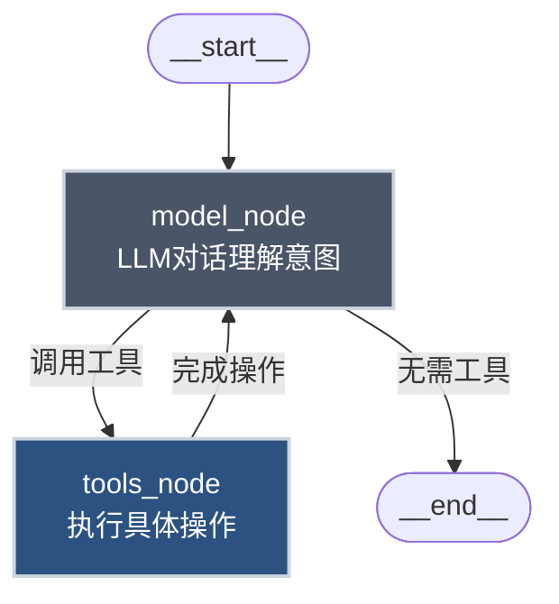

# Resume Optimizer Agent 流程设计

## 核心定位调整：从"改写工具"到"竞争力挖掘助手"

### 业内洞察
> **"简历的核心在于沟通和挖掘，AI只能针对问题来极大化，不能挖掘竞争力"**

### 调整策略
传统AI简历工具的问题：
- ❌ 只做表面优化（换动词、加量化）
- ❌ 缺乏对用户真实竞争力的挖掘
- ❌ 用户输入什么就改什么，不会追问深层价值

我们的差异化定位：
- ✅ **对话式挖掘**：通过结构化访谈，引导用户表达隐藏的成果
- ✅ **竞争力分析**：识别用户独特优势与差异化卖点
- ✅ **增量式构建**：从空白/粗糙简历逐步填充高质量内容
- ✅ **JD对齐为辅**：评分与关键词匹配只是检验手段，不是目的

---

## 整体架构流程图（重构版）



## 简化版流程（类似旅游规划示例）



## 核心节点说明

### 1. chat_node（对话路由）
- **职责**: 
  - 接收用户输入（自然语言）
  - 识别意图：需要JD、要评分、要改写、退出
  - 维护会话状态
- **输出**: 路由决策（到哪个节点）

### 2. fetch_jd_node（JD获取）
- **职责**:
  - 用户手动粘贴JD
  - Chrome爬虫推送JD（`POST /jd/import`）
  - 从历史JD中选择
  - AI辅助搜索相关岗位（可选）
- **输出**: `JobDescriptionDto`

### 3. score_node（评分分析）
- **职责**:
  - 调用 `POST /score { resumeId, jdId }`
  - 返回 `ScoreResultDto`（总分+分项+缺口+关键词）
  - 展示评分卡片与细项明细
- **输出**: 评分结果到前端UI

### 4. propose_edits_node（生成改写建议）
- **职责**:
  - 基于评分缺口，LLM生成改写建议
  - 触发前端Copilot动作：
    - `alignToJD`: 对齐关键词到经验/项目
    - `rewriteBullets`: 强化子弹点（动词+量化）
    - `optimizeSkills`: 技能优化
  - 渲染 `ChangeApprovalCard`（Diff展示）
- **输出**: 待审批的修改建议（中断等待）

### 5. WaitApproval（用户审批）
- **职责**: 
  - 用户点击"Accept"或"Reject"
  - Accept → 进入 `apply_edits_node`
  - Reject → 返回 `chat_node` 重新对话
- **实现**: 利用 `renderAndWaitForResponse` 机制（你现有代码已实现）

### 6. apply_edits_node（应用修改）
- **职责**:
  - 前端：调用 `setValue` 更新 `ResumeStore`
  - 后端：调用 `PATCH /resume/:id` 持久化
- **输出**: 保存成功/失败状态

### 7. rescore_node（重新评分）
- **职责**:
  - 自动调用 `POST /score { resumeId, jdId }`
  - 展示新分数与提升幅度
  - 建议是否继续优化
- **输出**: 新的评分结果

---

## 状态定义（AgentState）

```typescript
type AgentState = {
  // 会话上下文
  conversationId: string;
  userId: string;
  
  // 简历与JD
  resumeId: string;
  resume: ResumeData | null;
  selectedJdId: string | null;
  jd: JobDescriptionDto | null;
  
  // 评分结果
  currentScore: ScoreResultDto | null;
  previousScore: ScoreResultDto | null;  // 用于对比提升
  
  // 改写状态
  pendingEdits: Array<{
    action: string;
    payload: unknown;
    status: "pending" | "accepted" | "rejected";
  }>;
  
  // 循环控制
  iterationCount: number;
  maxIterations: number;
  
  // 意图与路由
  userIntent: "fetch_jd" | "score" | "optimize" | "rescore" | "exit" | null;
};
```

---

## 工具（Tools）定义

类似旅游规划的 `tools_node`，我们定义以下工具供LLM调用：

```typescript
const tools = [
  {
    name: "fetch_jd",
    description: "获取或选择职位描述（JD）",
    parameters: {
      source: "manual" | "chrome" | "history" | "search",
      content?: string,  // manual时需要
      jdId?: string,     // history时需要
      searchQuery?: string, // search时需要
    }
  },
  {
    name: "score_resume",
    description: "对简历与JD进行匹配评分",
    parameters: {
      resumeId: string,
      jdId: string,
    }
  },
  {
    name: "align_to_jd",
    description: "将指定经验/项目对齐到JD关键词",
    parameters: {
      sectionKey: "experience" | "projects" | "skills",
      itemId: string,
      targetKeywords: string[],
      reason?: string,
    }
  },
  {
    name: "rewrite_bullets",
    description: "改写子弹点，添加动词和量化数据",
    parameters: {
      experienceId: string,
      bullets: string[],
      reason?: string,
    }
  },
  {
    name: "optimize_skills",
    description: "优化技能列表",
    parameters: {
      add: string[],
      remove?: string[],
      reason?: string,
    }
  },
  {
    name: "rescore",
    description: "重新评分（应用修改后）",
    parameters: {
      resumeId: string,
      jdId: string,
    }
  }
];
```

---

## 路由逻辑（route函数）

```typescript
function route(state: AgentState): string {
  const { userIntent, selectedJdId, currentScore, pendingEdits } = state;
  
  // 1. 如果没有JD，先获取JD
  if (!selectedJdId) {
    return "fetch_jd_node";
  }
  
  // 2. 如果有JD但未评分，进行评分
  if (selectedJdId && !currentScore) {
    return "score_node";
  }
  
  // 3. 如果有待审批的编辑，等待用户
  if (pendingEdits.some(e => e.status === "pending")) {
    return "propose_edits_node";  // 实际会在前端中断
  }
  
  // 4. 如果用户接受了编辑，应用
  if (pendingEdits.some(e => e.status === "accepted")) {
    return "apply_edits_node";
  }
  
  // 5. 根据意图路由
  switch (userIntent) {
    case "fetch_jd":
      return "fetch_jd_node";
    case "score":
      return "score_node";
    case "optimize":
      return "propose_edits_node";
    case "rescore":
      return "rescore_node";
    case "exit":
      return "__end__";
    default:
      return "chat_node";
  }
}
```

---

## 中断点（Interrupt）

参考旅游规划的 `interrupt_after`，我们在以下节点后中断：

```typescript
graph.compile({
  interrupt_after: ["propose_edits_node"],  // 等待用户审批
  checkpointer: MemorySaver(),  // 保存状态以便恢复
});
```

当用户点击"Accept"或"Reject"后，通过 `respond({ status: "accepted" })` 恢复状态机。

---

## 与现有代码的集成

### 前端（已有能力）
- ✅ CopilotKit 聊天界面（`apps/client/src/pages/agent/chat.tsx`）
- ✅ Copilot 动作注册（`use-resume-actions.tsx`）
- ✅ 审批卡片（`ChangeApprovalCard`）
- ✅ Diff 展示（`DiffViewer`）

### 前端（需新增）
- 🔲 JD 面板组件（选择/新增/粘贴JD）
- 🔲 评分卡片（显示总分+分项+缺口列表）
- 🔲 对齐JD的新动作（`alignToJD`, `rewriteBullets`, `optimizeSkills`, `rescore`）

### 后端（已有能力）
- ✅ 简历CRUD（`apps/server/src/resume/`）
- ✅ 用户鉴权（`@UseGuards(TwoFactorGuard)`）

### 后端（需新增）
- 🔲 JD模块（`apps/server/src/job-description/`）
  - Entity/DTO
  - Controller（CRUD + import）
  - Service
- 🔲 评分模块（`apps/server/src/scoring/`）
  - Service（语义相似度+关键词覆盖+经验对齐）
  - Controller（`POST /score`, `POST /score/batch`）

---

## 实现优先级

### Phase 1: 基础评分（1-2天）
1. 后端JD模块（Entity + CRUD）
2. 后端评分服务（仅 semantic + keyword）
3. 前端JD面板（手动粘贴+选择）
4. 前端评分卡片（显示总分+缺口）

### Phase 2: 改写与审批（2-3天）
5. 前端新增3个Copilot动作（alignToJD, rewriteBullets, optimizeSkills）
6. 后端评分服务增强（经验对齐+ATS启发）
7. 前端rescore按钮与对比展示

### Phase 3: 爬虫与自动化（1-2天）
8. Chrome爬虫接入（`POST /jd/import`）
9. AI辅助搜索岗位（可选）
10. Batch评分（多JD快速对比）

### Phase 4: 优化与评估（持续）
11. 评分算法调优（参考Resume-Matcher）
12. 离线基准数据集
13. 用户接受率统计与分析

---

## 参考链接

- [Resume-Matcher GitHub](https://github.com/srbhr/Resume-Matcher) - 关键词优化与匹配算法参考
- [LangGraph StateGraph](https://langchain-ai.github.io/langgraph/) - 状态机框架
- 你的旅游规划示例代码（参考路由与中断机制）

---

## 总结

这个流程设计遵循以下原则：
1. **简单优先**: 从最小可行闭环开始（JD→评分→改写→审批→保存→重评）
2. **复用现有**: 充分利用你已有的Copilot动作与审批UI
3. **增量扩展**: 先做核心（评分+改写），再接爬虫与批量
4. **用户可控**: 所有改写必须经过Diff审批，避免意外覆盖

参照旅游规划的 `model → tools` 循环模式，我们的Agent本质是：
- **model**: LLM理解用户意图（"帮我对齐这个JD"）
- **tools**: 调用评分/改写/保存等工具
- **循环**: 评分→改写→审批→重评，直到用户满意

如果同意这个设计，我将立即开始实现 **Phase 1: 基础评分**。

