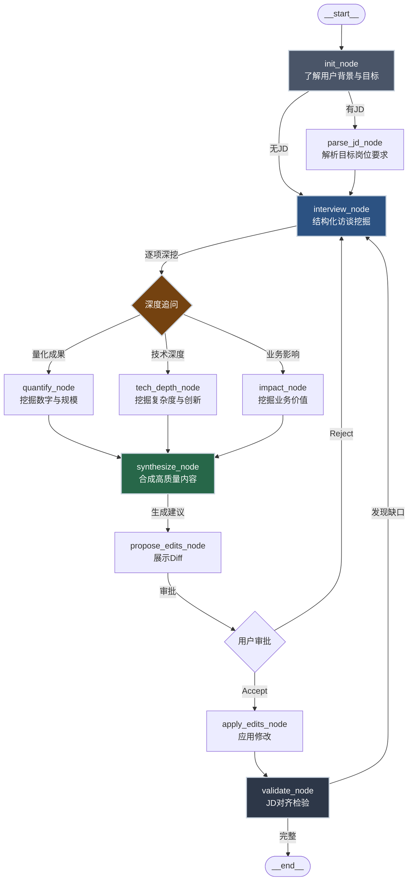

# Resume Optimizer Agent 流程设计 V2
## "竞争力挖掘对话助手"版本

---

## 核心理念：沟通与挖掘 > 机械改写

### 业内人士洞察
> **"简历的核心在于沟通和挖掘，AI只能针对问题来极大化，不能挖掘竞争力"**

### 问题诊断
现有AI简历工具的局限：
1. **被动改写**：用户写什么就改什么，不会追问"为什么"
2. **表面优化**：换强动词、加量化数字，但缺乏对业务价值的理解
3. **关键词堆砌**：为了ATS得分盲目塞词，丧失真实性
4. **缺乏挖掘**：无法引导用户表达隐藏的成果与独特优势

### 我们的差异化定位

#### 1. 对话式竞争力挖掘（核心能力）
通过**结构化访谈**，引导用户表达：
- **量化成果**：项目规模、性能提升、成本节约、用户增长
- **技术深度**：复杂问题、创新方案、技术选型理由
- **业务影响**：给公司/团队带来的实际价值
- **独特优势**：与竞争者的差异化能力

#### 2. 增量式内容构建
不是"改写现有内容"，而是：
- **从零开始**：引导用户逐步填充空白/粗糙的简历
- **深度追问**：每个经历追问3-5轮，挖掘细节
- **对比提炼**：与目标岗位JD对比，找出缺失的亮点

#### 3. JD评分为辅（验证手段）
- 评分不是目的，而是检验"竞争力是否有效传达"
- 关键词匹配用于查漏补缺，而非堆砌

---

## 重构后的流程图



---

## 核心节点详解

### 1. init_node（了解背景与目标）
**目的**: 建立对话基础，明确优化目标，**识别岗位类型**

#### 岗位分类策略
```typescript
type JobCategory = 
  | "tech_engineering"      // 技术研发：工程师、架构师、算法
  | "tech_product"          // 技术产品：产品经理、项目经理
  | "business_sales"        // 业务销售：销售、BD、客户成功
  | "business_operations"   // 业务运营：运营、市场、增长
  | "business_function"     // 职能支持：HR、财务、行政
  | "creative_design";      // 创意设计：设计师、内容创作

// 根据目标岗位自动分类，或引导用户选择
```

#### 对话示例（技术岗）
```
Agent: "你好！我会通过对话帮你挖掘简历亮点。先了解一下：
- 你的目标岗位是？（如果有JD可以直接贴给我）
- 你目前的简历处于什么状态？（空白/粗糙/基本完整）
- 你最希望突出的优势是？"

User: "前端高级工程师，简历有基本内容但感觉平淡"

Agent: "明白了。作为技术岗位，我会重点帮你：
1. 挖掘项目中的**技术深度**与架构复杂度
2. 量化你的成果（性能提升、用户体验改善等）
3. 提炼你的独特优势（区别于普通前端的地方）

我们从你最自豪的一个项目开始，好吗？"
```

#### 对话示例（非技术岗）
```
User: "运营经理，负责用户增长"

Agent: "好的！作为运营岗位，我会重点帮你：
1. 挖掘你负责的**业务数据**与增长成果
2. 展现你的**策略思维**与执行能力
3. 提炼你的**资源整合**与跨部门协作能力

我们从你做过的最成功的增长项目开始，好吗？"
```

---

### 2. interview_node（结构化访谈）
**目的**: 通过追问挖掘深层内容，**根据岗位类型调整访谈重点**

---

## 技术岗访谈协议

#### 访谈协议（3轮追问法）

**第一轮：基本事实**
```
Agent: "先简单说说这个项目：
- 项目名称和你的角色？
- 主要做了什么功能？
- 用了哪些技术栈？"
```

**第二轮：技术深度与难点**
```
Agent: "很好！现在深挖技术细节：
- 项目规模多大？（用户量、数据量、并发、团队规模）
- 遇到过哪些**技术难点**？你是怎么解决的？
- 为什么选这个技术方案？有没有对比其他方案？
- 有没有性能优化、架构改进的具体数据？"
```

**第三轮：业务价值与创新性**
```
Agent: "最后关键的问题：
- 这个项目给公司/用户带来了什么实际价值？
- 你的方案与业界常规做法有什么不同？为什么更好？
- 如果让别人接手，他们会觉得哪部分最难复现？
- 这个技术有没有沉淀成团队基建或开源？"
```

---

## 非技术岗访谈协议

### 产品/项目经理

**第一轮：项目背景**
```
Agent: "先了解一下这个项目：
- 项目名称和你的角色？
- 解决了什么业务问题？为什么要做？
- 涉及哪些团队？你负责协调哪些资源？"
```

**第二轮：成果与难点**
```
Agent: "深入聊聊成果：
- 这个项目的关键业务指标是什么？达成情况如何？
- 遇到过哪些**跨部门协调**或**需求冲突**？你是怎么推动的？
- 有没有创新的产品方案或流程优化？"
```

**第三轮：影响力与复盘**
```
Agent: "最后关键的问题：
- 这个项目对公司战略/业务有什么影响？
- 老板/客户对你的工作有什么反馈？
- 这个项目给你最大的收获是什么？如果重新做会怎么优化？"
```

---

### 运营/增长

**第一轮：业务背景**
```
Agent: "先聊聊这个运营项目：
- 你负责的业务是什么？（用户运营、内容运营、活动运营？）
- 当时的业务目标是什么？
- 你的工作范围和团队配置？"
```

**第二轮：策略与数据**
```
Agent: "深入聊聊策略和效果：
- 你采取了哪些**运营策略**？为什么这么设计？
- 关键数据指标是什么？达成情况如何？
  （如：转化率、留存率、GMV、DAU）
- 有没有A/B测试或数据驱动的优化案例？"
```

**第三轮：创新与影响**
```
Agent: "最后的亮点：
- 你的策略与竞品或常规做法有什么不同？
- 这个项目对公司整体业务有什么贡献？
- 有没有沉淀出可复用的运营方法论或SOP？"
```

---

### 销售/BD

**第一轮：业务背景**
```
Agent: "先了解一下你的销售工作：
- 你负责什么产品/服务的销售？
- 客户类型是什么？（大客户/中小客户/个人）
- 你的销售目标和完成情况？"
```

**第二轮：成交案例与策略**
```
Agent: "聊聊你最成功的成交案例：
- 客户背景和需求是什么？
- 你是怎么**挖掘客户需求**和**建立信任**的？
- 遇到过哪些竞争对手？你是如何赢单的？
- 成交金额、周期、续约情况如何？"
```

**第三轮：业绩与能力**
```
Agent: "最后关键的问题：
- 你的业绩在团队中排名如何？
- 有没有开拓新客户、新市场的经验？
- 你的销售方法论或独特优势是什么？"
```

---

### 设计师

**第一轮：作品背景**
```
Agent: "先聊聊这个设计项目：
- 项目名称和你的角色？
- 设计目标是什么？（品牌升级、体验优化、营销物料？）
- 项目周期和团队配置？"
```

**第二轮：设计思路与难点**
```
Agent: "深入聊聊设计过程：
- 你的**设计理念**和核心创意是什么？
- 遇到过哪些设计挑战？（如需求冲突、技术限制）
- 你是如何做用户研究或数据验证的？"
```

**第三轮：效果与认可**
```
Agent: "最后的亮点：
- 这个设计带来了什么业务效果？
  （如转化率提升、品牌认知度、用户满意度）
- 有没有获奖、被媒体报道、或内部表彰？
- 你的设计有什么独特性？与竞品相比有什么差异？"
```

---

### 3. quantify_node（量化挖掘）
**目的**: 引导用户表达可衡量的成果

追问模板：
- "首屏加载时间从多少降到多少？"
- "这个优化影响了多少用户？"
- "节省了多少开发时间/成本？"
- "代码体积减少了多少？"
- "转化率/留存率提升了百分之多少？"

---

### 4. tech_depth_node（技术深度挖掘）
**目的**: 展现技术复杂度与创新性

追问模板：
- "为什么选这个方案而不是XXX？"
- "你们的架构与开源方案的区别在哪？"
- "这个问题在业界是怎么解决的？你们做了什么改进？"
- "如果让你给新人讲这个难点，你会怎么说？"

---

### 5. impact_node（业务影响挖掘）
**目的**: 将技术成果翻译成业务语言

追问模板：
- "这个优化对业务指标（GMV、DAU、转化率）有什么影响？"
- "产品/运营团队对你的工作有什么反馈？"
- "如果没有你这个优化，会发生什么？"
- "你的工作帮助团队避免了哪些问题？"

---

### 6. synthesize_node（合成高质量内容）
**目的**: 将零散信息整合成结构化简历内容

输入：
```json
{
  "rawInput": "做了一个商品详情页优化",
  "quantify": "首屏时间从3.2s降到1.1s，影响日均200万用户",
  "techDepth": "采用SSR+骨架屏+懒加载组合方案，自研了图片预加载调度器",
  "impact": "转化率提升8%，月GMV增加500万"
}
```

输出（Diff展示）：
```diff
- 负责商品详情页开发与优化

+ 主导商品详情页性能优化，首屏加载从3.2s降至1.1s（65%提升），
  影响日均200万用户；采用SSR+骨架屏+自研图片预加载调度器，
  转化率提升8%，月GMV增加500万元
```

---

### 7. validate_node（JD对齐检验）
**目的**: 检验挖掘出的竞争力是否有效传达

检验维度：
1. **关键词覆盖**：JD要求的技能/技术是否体现？
2. **经验匹配**：项目复杂度与目标岗位是否对等？
3. **差异化**：简历是否展现了独特优势？
4. **可信度**：量化数据是否合理、可验证？

如果发现缺口，返回 `interview_node` 继续挖掘。

---

## 对比：改写工具 vs 挖掘助手

| 维度         | 传统改写工具                     | 我们的挖掘助手                         |
| ------------ | -------------------------------- | -------------------------------------- |
| **核心能力** | 润色现有文本                     | 引导用户表达隐藏价值                   |
| **交互方式** | 单向输入→输出                    | 多轮对话挖掘                           |
| **内容来源** | 完全依赖用户输入                 | 通过追问生成新内容                     |
| **优化目标** | 关键词匹配、ATS得分              | 竞争力传达、差异化                     |
| **适用场景** | 简历已有基本内容                 | 从零开始或内容粗糙                     |
| **价值定位** | 效率工具（节省改写时间）         | 咨询服务（挖掘与提炼）                 |
| **用户体验** | "帮我改好"                       | "帮我想清楚我的优势在哪"               |
| **技术门槛** | 低（模板+关键词）                | 高（结构化访谈+业务理解）              |
| **竞争壁垒** | 弱（易被复制）                   | 强（需要prompt工程+领域知识）          |

---

## 实现要点

### 1. 结构化访谈Prompt设计
```typescript
const interviewPrompts = {
  quantify: {
    trigger: ["项目", "优化", "开发"],
    questions: [
      "这个项目的规模有多大？（用户量、数据量、团队规模）",
      "有没有具体的性能提升数据？（速度、体积、成功率）",
      "你的工作影响了多少人/多少业务？",
    ]
  },
  techDepth: {
    trigger: ["架构", "方案", "技术"],
    questions: [
      "为什么选这个技术方案？有没有对比其他方案？",
      "遇到过哪些技术难点？怎么解决的？",
      "你们的实现与业界常见做法有什么不同？",
    ]
  },
  impact: {
    trigger: ["结果", "效果", "价值"],
    questions: [
      "这个工作对公司业务有什么实际影响？",
      "产品/运营/老板对你的工作有什么反馈？",
      "如果没做这个，会发生什么问题？",
    ]
  }
};
```

### 2. 挖掘深度控制
```typescript
type DigDepth = {
  currentRound: number;        // 当前追问轮次
  maxRounds: number;           // 最大3-5轮
  satisfactionLevel: number;   // LLM评估内容充实度 0-100
  stopConditions: {
    hasQuantify: boolean;      // 是否有量化数据
    hasTechDepth: boolean;     // 是否有技术深度
    hasImpact: boolean;        // 是否有业务影响
  }
};

// 当满足条件或达到最大轮次时，进入 synthesize_node
```

### 3. 竞争力分析模块
```typescript
type CompetitiveAnalysis = {
  // 识别用户独特优势
  uniqueStrengths: Array<{
    category: "technical" | "business" | "leadership";
    description: string;
    evidence: string[];        // 从访谈中提取的支撑证据
    differentiator: string;    // 与竞争者的差异
  }>;
  
  // 与目标岗位的匹配度
  jdAlignment: {
    must_have: { matched: string[]; missing: string[] };
    nice_to_have: { matched: string[]; missing: string[] };
  };
  
  // 建议的叙事角度
  narrativeAngle: {
    angle: "深度专家" | "全栈通才" | "业务驱动" | "技术创新";
    rationale: string;
  };
};
```

---

## 用户体验示例

### 场景：优化一个粗糙的项目经历

**用户原始输入**：
```
"负责公司官网重构，使用React技术栈"
```

**Agent对话流程**：

```
Agent: "官网重构是个大工程！我想了解更多细节：
1. 这次重构的背景是什么？旧官网有什么问题？
2. 新官网的访问量和业务规模大概多少？
3. 你在团队中的角色？是独立完成还是带团队？"

User: "旧官网加载慢、SEO差。新官网日均UV 50万，我是前端负责人，带2个人。"

Agent: "很好！继续深挖技术细节：
1. 加载慢的具体数据是？重构后改善了多少？
2. SEO优化具体做了什么？排名有没有提升？
3. 为什么选React？有没有考虑过Next.js或其他SSR方案？"

User: "首屏从5s降到1.5s，核心词排名从第3页到首页前5。
用了Next.js做SSR，还做了代码分割和CDN优化。"

Agent: "太棒了！最后一个关键问题：
这个重构对公司业务有什么实际影响？比如询盘量、转化率？"

User: "月询盘量从200增加到500，Sales说成交转化率提升了20%。"

Agent: "完美！基于我们的对话，我建议这样写：
（展示Diff）
```

**生成的高质量内容**：
```diff
- 负责公司官网重构，使用React技术栈

+ 主导官网重构项目（日均UV 50万），采用Next.js SSR方案，
  首屏加载从5s优化至1.5s（70%提升），核心关键词SEO排名
  从第3页跃升至首页前5，月询盘量增长150%（200→500），
  成交转化率提升20%，直接带动销售线索增长
```

---

## 评估指标（重新定义）

### 传统指标（次要）
- ATS匹配分
- 关键词覆盖率

### 核心指标（主要）
1. **挖掘深度**：平均追问轮次、用户补充的新信息量
2. **内容质量**：量化数据比例、技术深度评分、业务影响清晰度
3. **差异化**：识别出的独特优势数量
4. **用户满意度**：对生成内容的接受率、修改幅度
5. **面试转化**：简历投递后的面试邀约率（需用户反馈）

---

## 技术实现路径

### Phase 1: 访谈引擎（核心）
1. 设计访谈协议（3轮追问模板）
2. 实现上下文记忆（记住用户说过的信息）
3. 挖掘深度控制（满足条件后进入合成）

### Phase 2: 竞争力分析
4. 从访谈内容中提取量化数据、技术难点、业务价值
5. 与JD对比，找出缺失的亮点
6. 识别用户独特优势

### Phase 3: 内容合成与审批
7. 将零散信息整合成高质量子弹点
8. Diff展示与用户审批（复用现有 `ChangeApprovalCard`）
9. 应用修改并保存

### Phase 4: 验证与迭代
10. JD对齐检验（发现缺口返回访谈）
11. 评分对比（优化前后）
12. 用户反馈收集

---

## 关键技术挑战

### 1. 追问质量
- **问题**: 如何避免机械追问？
- **方案**: 
  - 基于用户回答动态调整问题
  - 识别已有信息，避免重复追问
  - 用自然语言而非问卷式提问

### 2. 上下文记忆
- **问题**: 多轮对话如何保持连贯？
- **方案**:
  - 维护结构化状态（用户说过的facts）
  - 每次追问前回顾已知信息
  - 使用长上下文模型（Claude/GPT-4）

### 3. 内容合成
- **问题**: 如何将零散信息写成专业简历语言？
- **方案**:
  - Few-shot examples（好简历 vs 差简历对比）
  - 模板库（不同岗位/行业的优秀范例）
  - 数据验证（量化数据是否合理）

---

## 竞争优势分析

### vs 传统简历工具
- ❌ Rezi/Resume.io：只做表面改写，无挖掘能力
- ❌ Jobscan：只做关键词匹配，无内容生成
- ✅ 我们：从零开始构建高质量内容

### vs AI聊天工具（ChatGPT直接问）
- ❌ 用户不知道该问什么
- ❌ 缺乏结构化流程，容易遗漏关键信息
- ✅ 我们：主动引导，系统化挖掘

### vs 人工简历服务
- ❌ 人工：贵（几百到几千）、慢（几天）
- ✅ 我们：便宜、快、24小时可用
- ⚠️ 需要时间验证质量能否达到专业水平

---

## 总结：从"工具"到"顾问"

### 产品定位升级
- **传统定位**: 简历优化工具（与Grammarly类似）
- **新定位**: AI简历顾问（与职业咨询师类似）

### 核心价值主张
> "我们不是帮你改简历，而是帮你**想清楚**你的竞争力在哪里，
> 然后用最有效的方式表达出来。"

### 用户心智
- 传统工具："帮我改好" → 被动接受
- 我们："我不知道怎么写更好" → **主动引导**

### 商业化潜力
- 免费版：基础改写（保留流量入口）
- 付费版：**深度访谈挖掘**（核心价值，可定价更高）
- 企业版：团队简历库、行业定制化访谈协议

---

## 下一步行动

1. **验证假设**: 找5-10个用户做访谈挖掘测试，收集反馈
2. **完善Prompt**: 设计3轮追问的具体话术与触发条件
3. **最小闭环**: 实现一个完整的"项目经历挖掘→合成→审批"流程
4. **效果对比**: 对比"直接改写"vs"访谈挖掘"的内容质量差异

---

如果同意这个方向，我将立即开始实现 **访谈引擎原型**（interview_node + 3轮追问协议）。

